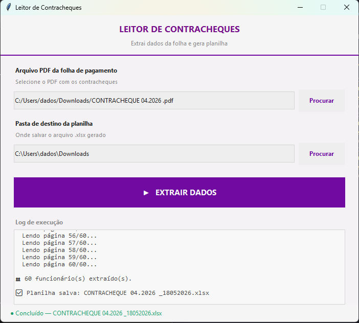

# ContraX Extract

Extrai dados de contracheques em PDF e gera uma planilha Excel estruturada, com validação automática e aba de alertas para inconsistências.

Sem digitação manual. Sem abrir PDF. Sem copiar e colar.

**Stack:** Python · pdfplumber · openpyxl · Tkinter  
**Interface:** Desktop (GUI)  
**Output:** `.xlsx` com formatação, agrupamento por categoria e linha de totais  

---

## O problema

Conferir folha de pagamento era manual — abrir PDF, ler cada contracheque, digitar os valores. Com dezenas de funcionários, o processo tomava horas e estava sujeito a erro humano.

---

## O que o sistema faz

- Lê PDF de folha de pagamento com múltiplos contracheques
- Extrai automaticamente: identificação, proventos, descontos e totais
- Valida consistência dos dados (proventos - descontos = líquido)
- Gera `.xlsx` estruturado com agrupamento por categoria e linha de totais
- Cria aba de alertas quando detecta inconsistências
- Versiona o arquivo de saída automaticamente (`_v02`, `_v03`...)
- Interface desktop para uso sem linha de comando

---

## Interface



---

## Campos extraídos

**Identificação**

| Campo | Descrição |
|---|---|
| Cód | Código do funcionário |
| Nome | Nome completo |
| CBO | Classificação Brasileira de Ocupações |
| Cargo | Cargo na empresa |
| Admissão | Data de admissão |

**Proventos**

Salário Base, Gerência, Supervisão, H. Extras, Adic. Tempo de Serviço, Adic. Noturno, Sal. Família, Sal. Maternidade, Total Proventos

**Descontos**

INSS, IRRF, Faltas, Vale Transp., Vale Alim., Plano Saúde, Plano Odonto, Consignado, Adiant. 13º, Adiantamento, Total Descontos

**Totais**

Valor Líquido, FGTS do Mês

---

## Validações automáticas

O sistema valida cada registro antes de gerar o arquivo:

- Campos obrigatórios ausentes
- Consistência: `proventos - descontos = líquido` (tolerância R$ 0,02)
- FGTS maior que o líquido
- Salário base zero ou negativo
- Total de descontos maior que total de proventos
- Floats com casas decimais incorretas

Registros com problema aparecem na aba **Alertas** do Excel, sem bloquear a geração do arquivo.

---

## Estrutura do projeto

```
contrax-extract/
├── src/
│   └── contrax_extract.py
├── assets/
│   └── contrax-extract.png
├── requirements.txt
└── README.md
```

---

## Instalação e uso

```bash
pip install -r requirements.txt
python src/contrax_extract.py
```

1. Selecione o PDF da folha de pagamento
2. Selecione a pasta de destino
3. Clique em **Extrair Dados**

O arquivo `.xlsx` é gerado na pasta selecionada com o nome do PDF original e a data de execução.

---

## requirements.txt

```
pdfplumber
openpyxl
Pillow
```

---

> Dados de funcionários são processados localmente e nunca enviados a nenhum servidor. Nenhum dado real foi incluído neste repositório.
